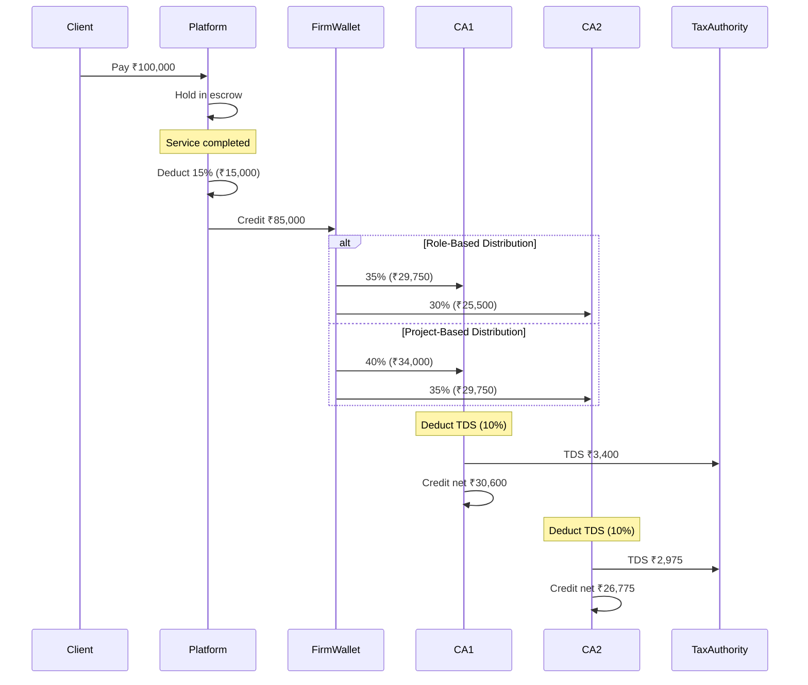

# Payment Distribution System - Complete Guide

**Status:** ✅ **FULLY IMPLEMENTED & OPERATIONAL**
**Date:** 2026-01-23

---

## Table of Contents

1. [Executive Summary](#executive-summary)
2. [System Architecture](#system-architecture)
3. [Distribution Models](#distribution-models)
4. [Database Schema](#database-schema)
5. [API Endpoints](#api-endpoints)
6. [Payment Flow](#payment-flow)
7. [Tax Handling](#tax-handling)
8. [Wallet Management](#wallet-management)
9. [Payout Processing](#payout-processing)
10. [Usage Examples](#usage-examples)
11. [Testing Scenarios](#testing-scenarios)

---

## Executive Summary

The Payment Distribution System provides automated payment distribution for CA firm projects with role-based and custom splits, performance bonuses, wallet management, and comprehensive tax handling (TDS/GST).

### Key Features

✅ **Automated Payment Distribution**
- Platform deducts 15% commission (vs 10% for individuals)
- Remaining 85% distributed to firm members
- Role-based default splits
- Project-based custom splits
- Performance bonuses (early completion, quality, referrals)

✅ **Wallet Management**
- Firm wallet with balance tracking
- Individual CA wallets
- Transaction history and audit trail
- Real-time balance updates

✅ **Payout Processing**
- Withdrawal requests (Bank Transfer, UPI, RTGS, NEFT, IMPS)
- Admin approval workflow
- TDS deduction at source
- Automated payout processing

✅ **Tax Compliance**
- Automatic TDS calculation (10% for 194J)
- GST calculation (18%)
- Quarterly TDS certificates (Form 16A)
- Tax record management
- Certificate generation

---

## System Architecture

### Distribution Hierarchy

```
Client Payment (₹100,000)
    ↓
Platform Escrow
    ↓
Work Completed
    ↓
Platform deducts 15% (₹15,000)
    ↓
Firm receives 85% (₹85,000)
    ↓
Distribution based on model:
    ├── Role-based: FIRM_ADMIN (35%), SENIOR_CA (30%), JUNIOR_CA (20%), SUPPORT (15%)
    ├── Project-based: Custom percentages per member
    └── Performance bonuses added

Each CA receives:
    └── Amount - TDS (10%) = Net Payment to Wallet
```

### Components

1. **Payment Distribution Service** (`payment-distribution.service.ts`)
   - Distribution template management
   - Project distribution setup
   - Automated payment splitting
   - Performance bonus calculation

2. **Wallet Service** (`wallet.service.ts`)
   - Wallet balance management
   - Transaction tracking
   - Payout request handling
   - Withdrawal processing

3. **Tax Service** (`tax.service.ts`)
   - TDS calculation (194J, 194C)
   - GST calculation
   - Certificate generation
   - Tax record management

4. **API Routes** (`payment-distribution.routes.ts`)
   - 30+ endpoints for all operations
   - Role-based authorization
   - Comprehensive error handling

---

## Distribution Models

### 1. Role-Based Default Split

Configurable default percentages for each role within a firm.

**Example Configuration:**

| Role | Default % | Min % | Max % |
|------|-----------|-------|-------|
| FIRM_ADMIN | 35% | 30% | 40% |
| SENIOR_CA | 30% | 25% | 35% |
| JUNIOR_CA | 20% | 15% | 25% |
| SUPPORT_STAFF | 15% | 5% | 15% |

**When to use:**
- Standard projects with regular team composition
- Quick project setup without custom negotiation
- Consistent firm policy application

**API:** `POST /api/firms/:firmId/distribution-templates`

### 2. Project-Based Custom Split

Custom percentage allocation for specific projects.

**Features:**
- Override default role percentages
- Based on actual contribution hours
- Requires all involved members' digital approval
- Tracked per project

**When to use:**
- High-value projects requiring specialized skills
- Projects with unequal workload distribution
- Special client engagements

**API:** `POST /api/projects/:requestId/distribution-setup`

### 3. Performance-Based Bonuses

Additional earnings on top of base distribution.

**Bonus Types:**

1. **Early Completion Bonus**
   - Awarded when project completes before deadline
   - Typically 5-10% of project value
   - Split among all team members

2. **Quality Bonus**
   - Based on client rating (4.5+ stars)
   - 2-5% of project value
   - Encourages high-quality work

3. **Referral Bonus**
   - When CA brings new client to firm
   - Flat amount or percentage
   - Paid to referring CA

**Example:**
```
Project Amount: ₹100,000
Platform Fee (15%): -₹15,000
Net to Distribute: ₹85,000
Early Completion Bonus: +₹5,000
Quality Bonus (5-star rating): +₹3,000
Total Distribution Pool: ₹93,000
```

---

## Database Schema

### New Models (6 models)

#### 1. **DistributionTemplate**

Role-based default distribution configuration.

```prisma
model DistributionTemplate {
  id                String         @id @default(uuid())
  firmId            String
  role              FirmMemberRole

  defaultPercentage Float // Default % for this role
  minPercentage     Float // Minimum allowed
  maxPercentage     Float // Maximum allowed

  isActive          Boolean @default(true)

  firm              CAFirm @relation(...)

  createdAt         DateTime @default(now())
  updatedAt         DateTime @updatedAt

  @@unique([firmId, role])
}
```

#### 2. **ProjectDistribution**

Project-specific distribution setup.

```prisma
model ProjectDistribution {
  id                   String           @id @default(uuid())
  firmId               String
  requestId            String           @unique
  type                 DistributionType

  totalAmount          Float
  platformCommission   Float // 15%
  firmRetention        Float
  distributionAmount   Float
  bonusPool            Float @default(0.0)

  isApproved           Boolean   @default(false)
  approvedAt           DateTime?
  isDistributed        Boolean   @default(false)
  distributedAt        DateTime?
  requiresApproval     Boolean   @default(true)

  earlyCompletionBonus Float @default(0.0)
  qualityBonus         Float @default(0.0)
  referralBonus        Float @default(0.0)

  firm                 CAFirm @relation(...)
  request              ServiceRequest @relation(...)
  shares               DistributionShare[]

  createdAt            DateTime @default(now())
  updatedAt            DateTime @updatedAt
}
```

#### 3. **DistributionShare**

Individual member's share in a project.

```prisma
model DistributionShare {
  id                String  @id @default(uuid())
  distributionId    String
  caId              String

  percentage        Float
  baseAmount        Float
  bonusAmount       Float @default(0.0)
  totalAmount       Float
  contributionHours Float?

  approvedByCA      Boolean   @default(false)
  approvedAt        DateTime?
  signature         String? // Digital signature

  distribution      ProjectDistribution @relation(...)
  ca                CharteredAccountant @relation(...)

  createdAt         DateTime @default(now())
  updatedAt         DateTime @updatedAt

  @@unique([distributionId, caId])
}
```

#### 4. **WalletTransaction**

Audit trail for all wallet operations.

```prisma
model WalletTransaction {
  id              String                 @id @default(uuid())
  type            WalletTransactionType
  status          WalletTransactionStatus

  firmId          String?
  caId            String?

  amount          Float
  balanceBefore   Float
  balanceAfter    Float
  description     String
  referenceType   String?
  referenceId     String?

  tdsAmount       Float? @default(0.0)
  tdsPercentage   Float? @default(0.0)
  gstAmount       Float? @default(0.0)
  gstPercentage   Float? @default(0.0)
  netAmount       Float?

  processedAt     DateTime?
  processedBy     String?
  failureReason   String?

  firm            CAFirm? @relation(...)
  ca              CharteredAccountant? @relation(...)

  createdAt       DateTime @default(now())
  updatedAt       DateTime @updatedAt
}
```

**Transaction Types:**
- `PAYMENT_RECEIVED` - Payment credited to wallet
- `COMMISSION_DEDUCTED` - Platform commission deducted
- `DISTRIBUTION_RECEIVED` - Share from project distribution
- `WITHDRAWAL_REQUESTED` - Payout requested
- `WITHDRAWAL_COMPLETED` - Payout processed
- `BONUS_RECEIVED` - Performance bonus
- `REFUND_ISSUED` - Refund processed
- `ADJUSTMENT` - Manual adjustment

#### 5. **PayoutRequest**

Withdrawal requests from wallets.

```prisma
model PayoutRequest {
  id                String       @id @default(uuid())
  status            PayoutStatus

  firmId            String?
  caId              String?

  amount            Float
  payoutMethod      PayoutMethod
  requestedAt       DateTime @default(now())

  accountHolderName String
  accountNumber     String?
  ifscCode          String?
  bankName          String?
  upiId             String?

  tdsAmount         Float  @default(0.0)
  tdsPercentage     Float  @default(0.0)
  gstAmount         Float  @default(0.0)
  gstPercentage     Float  @default(0.0)
  netPayoutAmount   Float

  approvedAt        DateTime?
  approvedBy        String?
  processedAt       DateTime?
  completedAt       DateTime?
  rejectedAt        DateTime?
  rejectionReason   String?
  failureReason     String?
  transactionRef    String?

  firm              CAFirm? @relation(...)
  ca                CharteredAccountant? @relation(...)

  createdAt         DateTime @default(now())
  updatedAt         DateTime @updatedAt
}
```

**Payout Status Flow:**
```
REQUESTED → APPROVED → PROCESSING → COMPLETED
    ↓
REJECTED (if denied)
```

**Payout Methods:**
- `BANK_TRANSFER` - Standard bank transfer
- `UPI` - UPI payment
- `RTGS` - Real-Time Gross Settlement
- `NEFT` - National Electronic Funds Transfer
- `IMPS` - Immediate Payment Service

#### 6. **TaxRecord**

TDS and GST records for compliance.

```prisma
model TaxRecord {
  id                String  @id @default(uuid())
  taxType           TaxType

  firmId            String?
  caId              String?

  financialYear     String // FY 2025-26
  quarter           String? // Q1, Q2, Q3, Q4
  month             String? // For monthly GST

  taxableAmount     Float
  taxRate           Float
  taxAmount         Float
  totalAmount       Float

  panNumber         String?
  gstNumber         String?
  tan               String?

  certificateNumber String?
  certificateUrl    String?
  certificateDate   DateTime?

  challanNumber     String?
  challanDate       DateTime?
  paymentStatus     String @default("PENDING")
  filedDate         DateTime?

  firm              CAFirm? @relation(...)
  ca                CharteredAccountant? @relation(...)

  createdAt         DateTime @default(now())
  updatedAt         DateTime @updatedAt
}
```

**Tax Types:**
- `TDS_194J` - Professional/Technical Services (10%)
- `TDS_194C` - Contractor Payments (1% with PAN, 20% without)
- `GST_18` - Standard GST rate (18%)
- `GST_12` - Concessional GST rate (12%)
- `INCOME_TAX` - General income tax

### Enhanced Existing Models

#### CAFirm - Added Wallet Fields

```prisma
// Platform Fees
platformFeePercent Float @default(15.0) // 15% for firms

// Wallet & Financial
walletBalance      Float @default(0.0)
escrowBalance      Float @default(0.0)
totalEarnings      Float @default(0.0)
totalWithdrawals   Float @default(0.0)
```

#### CharteredAccountant - Added Wallet & Tax Fields

```prisma
// Wallet & Financial
walletBalance      Float @default(0.0)
totalEarnings      Float @default(0.0)
totalWithdrawals   Float @default(0.0)
pendingPayouts     Float @default(0.0)

// Tax Information
panNumber          String?
gstNumber          String?
tdsExempt          Boolean @default(false)
```

### New Enums (6 enums)

```prisma
enum DistributionType {
  ROLE_BASED
  PROJECT_BASED
  CUSTOM
}

enum WalletTransactionType {
  PAYMENT_RECEIVED
  COMMISSION_DEDUCTED
  DISTRIBUTION_RECEIVED
  WITHDRAWAL_REQUESTED
  WITHDRAWAL_COMPLETED
  BONUS_RECEIVED
  REFUND_ISSUED
  ADJUSTMENT
}

enum WalletTransactionStatus {
  PENDING
  PROCESSING
  COMPLETED
  FAILED
  CANCELLED
}

enum TaxType {
  TDS_194J
  TDS_194C
  GST_18
  GST_12
  INCOME_TAX
}

enum PayoutStatus {
  REQUESTED
  APPROVED
  PROCESSING
  COMPLETED
  REJECTED
  FAILED
}

enum PayoutMethod {
  BANK_TRANSFER
  UPI
  RTGS
  NEFT
  IMPS
}
```

---

## API Endpoints

### Distribution Templates

#### 1. Create/Update Distribution Template
```http
POST /api/firms/:firmId/distribution-templates
Authorization: Bearer {admin_token}

Body:
{
  "role": "SENIOR_CA",
  "defaultPercentage": 30,
  "minPercentage": 25,
  "maxPercentage": 35
}

Response:
{
  "success": true,
  "message": "Distribution template created successfully",
  "data": {
    "id": "template-uuid",
    "firmId": "firm-uuid",
    "role": "SENIOR_CA",
    "defaultPercentage": 30,
    "minPercentage": 25,
    "maxPercentage": 35,
    "isActive": true
  }
}
```

#### 2. Get Firm Templates
```http
GET /api/firms/:firmId/distribution-templates
Authorization: Bearer {token}

Response:
{
  "success": true,
  "data": [
    {
      "id": "...",
      "role": "FIRM_ADMIN",
      "defaultPercentage": 35,
      ...
    },
    {
      "id": "...",
      "role": "SENIOR_CA",
      "defaultPercentage": 30,
      ...
    }
  ]
}
```

### Project Distribution

#### 3. Setup Custom Distribution
```http
POST /api/projects/:requestId/distribution-setup
Authorization: Bearer {admin_token}

Body:
{
  "firmId": "firm-uuid",
  "type": "PROJECT_BASED",
  "shares": [
    {
      "caId": "ca1-uuid",
      "percentage": 40,
      "contributionHours": 80
    },
    {
      "caId": "ca2-uuid",
      "percentage": 35,
      "contributionHours": 70
    },
    {
      "caId": "ca3-uuid",
      "percentage": 25,
      "contributionHours": 50
    }
  ],
  "bonuses": {
    "earlyCompletionBonus": 5000,
    "qualityBonus": 3000
  }
}

Response:
{
  "success": true,
  "message": "Project distribution setup created successfully",
  "data": {
    "id": "dist-uuid",
    "totalAmount": 100000,
    "platformCommission": 15000,
    "distributionAmount": 85000,
    "bonusPool": 8000,
    "shares": [...]
  }
}
```

#### 4. Apply Default Distribution
```http
POST /api/projects/:requestId/apply-default-distribution
Authorization: Bearer {admin_token}

Response:
{
  "success": true,
  "message": "Default distribution applied successfully",
  "data": {
    "id": "dist-uuid",
    "type": "ROLE_BASED",
    "shares": [
      {
        "caId": "ca1-uuid",
        "percentage": 35,
        "baseAmount": 29750
      },
      ...
    ]
  }
}
```

#### 5. Approve Distribution Share (CA)
```http
POST /api/distribution-shares/:shareId/approve
Authorization: Bearer {ca_token}

Body:
{
  "signature": "digital-signature-hash"
}

Response:
{
  "success": true,
  "message": "Distribution share approved successfully",
  "data": {
    "id": "share-uuid",
    "approvedByCA": true,
    "approvedAt": "2026-01-23T14:30:00Z"
  }
}
```

#### 6. Distribute Payment (Admin)
```http
POST /api/payments/:paymentId/distribute
Authorization: Bearer {admin_token}

Response:
{
  "success": true,
  "message": "Payment distributed successfully",
  "data": {
    "success": true,
    "distributionId": "dist-uuid",
    "totalAmount": 100000,
    "platformCommission": 15000,
    "distributedAmount": 85000,
    "shares": 3
  }
}
```

#### 7. Get Distribution Statistics
```http
GET /api/firms/:firmId/distribution-stats
Authorization: Bearer {admin_token}

Response:
{
  "success": true,
  "data": {
    "total": 45,
    "approved": 40,
    "distributed": 38,
    "pending": 5,
    "totalAmount": 4250000
  }
}
```

### Wallet Management

#### 8. Get Firm Wallet
```http
GET /api/firm/:firmId/wallet
Authorization: Bearer {admin_token}

Response:
{
  "success": true,
  "data": {
    "wallet": {
      "id": "firm-uuid",
      "firmName": "ABC Associates",
      "walletBalance": 245000,
      "escrowBalance": 50000,
      "totalEarnings": 1500000,
      "totalWithdrawals": 1255000
    },
    "transactions": [...],
    "pendingDistributions": [...],
    "pendingPayouts": [...]
  }
}
```

#### 9. Get CA Wallet
```http
GET /api/member/:caId/wallet
Authorization: Bearer {ca_token}

Response:
{
  "success": true,
  "data": {
    "wallet": {
      "id": "ca-uuid",
      "walletBalance": 85000,
      "totalEarnings": 450000,
      "totalWithdrawals": 365000,
      "pendingPayouts": 0,
      "panNumber": "ABCDE1234F"
    },
    "transactions": [...],
    "pendingPayouts": [...],
    "taxRecords": [...]
  }
}
```

#### 10. Get Own Wallet (CA Convenience Endpoint)
```http
GET /api/member/wallet
Authorization: Bearer {ca_token}

Response:
{
  "success": true,
  "data": {
    "wallet": {...},
    "transactions": [...],
    "pendingPayouts": [...],
    "taxRecords": [...]
  }
}
```

### Payout Requests

#### 11. Request Payout - Firm
```http
POST /api/firm/:firmId/wallet/withdraw
Authorization: Bearer {admin_token}

Body:
{
  "amount": 100000,
  "payoutMethod": "BANK_TRANSFER",
  "accountHolderName": "ABC Associates",
  "accountNumber": "12345678901234",
  "ifscCode": "HDFC0001234",
  "bankName": "HDFC Bank"
}

Response:
{
  "success": true,
  "message": "Payout request created successfully",
  "data": {
    "id": "payout-uuid",
    "status": "REQUESTED",
    "amount": 100000,
    "tdsAmount": 0,
    "netPayoutAmount": 100000,
    "requestedAt": "2026-01-23T14:30:00Z"
  }
}
```

#### 12. Request Payout - CA
```http
POST /api/member/wallet/withdraw
Authorization: Bearer {ca_token}

Body:
{
  "amount": 50000,
  "payoutMethod": "UPI",
  "accountHolderName": "John Doe",
  "upiId": "johndoe@paytm"
}

Response:
{
  "success": true,
  "message": "Payout request created successfully",
  "data": {
    "id": "payout-uuid",
    "status": "REQUESTED",
    "amount": 50000,
    "tdsAmount": 5000,
    "tdsPercentage": 10,
    "netPayoutAmount": 45000,
    "requestedAt": "2026-01-23T14:30:00Z"
  }
}
```

#### 13. Get All Payout Requests (Admin)
```http
GET /api/admin/payout-requests?status=REQUESTED&page=1&limit=20
Authorization: Bearer {admin_token}

Response:
{
  "success": true,
  "data": {
    "requests": [...],
    "pagination": {
      "page": 1,
      "limit": 20,
      "total": 45,
      "totalPages": 3
    }
  }
}
```

#### 14. Get Firm Payout Requests
```http
GET /api/firm/:firmId/payout-requests?status=REQUESTED
Authorization: Bearer {admin_token}

Response:
{
  "success": true,
  "data": {
    "requests": [...],
    "pagination": {...}
  }
}
```

#### 15. Get CA Payout Requests
```http
GET /api/member/:caId/payout-requests
Authorization: Bearer {ca_token}

Response:
{
  "success": true,
  "data": {
    "requests": [...],
    "pagination": {...}
  }
}
```

#### 16. Approve Payout
```http
POST /api/payout-requests/:payoutId/approve
Authorization: Bearer {admin_token}

Response:
{
  "success": true,
  "message": "Payout approved successfully",
  "data": {
    "id": "payout-uuid",
    "status": "APPROVED",
    "approvedBy": "admin-uuid",
    "approvedAt": "2026-01-23T14:35:00Z"
  }
}
```

#### 17. Process Payout
```http
POST /api/payout-requests/:payoutId/process
Authorization: Bearer {admin_token}

Body:
{
  "transactionRef": "TXN123456789"
}

Response:
{
  "success": true,
  "message": "Payout processed successfully",
  "data": {
    "id": "payout-uuid",
    "status": "COMPLETED",
    "completedAt": "2026-01-23T14:40:00Z",
    "transactionRef": "TXN123456789"
  }
}
```

#### 18. Reject Payout
```http
POST /api/payout-requests/:payoutId/reject
Authorization: Bearer {admin_token}

Body:
{
  "reason": "Insufficient documentation provided"
}

Response:
{
  "success": true,
  "message": "Payout rejected successfully",
  "data": {
    "id": "payout-uuid",
    "status": "REJECTED",
    "rejectedAt": "2026-01-23T14:40:00Z",
    "rejectionReason": "Insufficient documentation provided"
  }
}
```

### Transaction History

#### 19. Get Firm Transactions
```http
GET /api/firm/:firmId/transactions?page=1&limit=20
Authorization: Bearer {admin_token}

Response:
{
  "success": true,
  "data": {
    "transactions": [
      {
        "id": "tx-uuid",
        "type": "PAYMENT_RECEIVED",
        "status": "COMPLETED",
        "amount": 85000,
        "balanceBefore": 160000,
        "balanceAfter": 245000,
        "description": "Payment received for request abc-123",
        "createdAt": "2026-01-23T10:00:00Z"
      },
      ...
    ],
    "pagination": {...}
  }
}
```

#### 20. Get CA Transactions
```http
GET /api/member/:caId/transactions?page=1&limit=20
Authorization: Bearer {ca_token}

Response:
{
  "success": true,
  "data": {
    "transactions": [...],
    "pagination": {...}
  }
}
```

### Tax Records

#### 21. Get Quarterly TDS Summary
```http
GET /api/tax/tds-summary?financialYear=FY%202025-26&quarter=Q1&caId=ca-uuid
Authorization: Bearer {ca_token}

Response:
{
  "success": true,
  "data": {
    "financialYear": "FY 2025-26",
    "quarter": "Q1",
    "summary": {
      "totalTaxable": 250000,
      "totalTDS": 25000,
      "recordCount": 5,
      "byType": {
        "TDS_194J": {
          "count": 5,
          "taxable": 250000,
          "tds": 25000
        }
      }
    },
    "records": [...]
  }
}
```

#### 22. Generate TDS Certificate
```http
GET /api/tax/tds-certificate?financialYear=FY%202025-26&quarter=Q1
Authorization: Bearer {ca_token}

Response:
{
  "success": true,
  "data": {
    "certificateNumber": "TDS/FY 2025-26/Q1/12345678",
    "financialYear": "FY 2025-26",
    "quarter": "Q1",
    "deductee": {
      "name": "John Doe",
      "pan": "ABCDE1234F",
      "email": "john@example.com"
    },
    "deductor": {
      "name": "CA Marketplace Platform",
      "tan": "PLAT12345A",
      "pan": "AABCP1234Q"
    },
    "summary": {
      "totalPayment": 250000,
      "totalTDS": 25000,
      "netPayment": 225000
    },
    "records": [...],
    "generatedAt": "2026-01-23T14:50:00Z"
  }
}
```

#### 23. Get GST Summary
```http
GET /api/tax/gst-summary?financialYear=FY%202025-26&month=Apr&firmId=firm-uuid
Authorization: Bearer {admin_token}

Response:
{
  "success": true,
  "data": {
    "financialYear": "FY 2025-26",
    "month": "Apr",
    "summary": {
      "totalTaxable": 500000,
      "totalGST": 90000,
      "recordCount": 10,
      "byRate": {
        "18": {
          "count": 10,
          "taxable": 500000,
          "gst": 90000
        }
      }
    },
    "records": [...]
  }
}
```

#### 24. Get All Tax Records
```http
GET /api/tax/records?caId=ca-uuid&financialYear=FY%202025-26&page=1&limit=20
Authorization: Bearer {ca_token}

Response:
{
  "success": true,
  "data": {
    "records": [
      {
        "id": "tax-uuid",
        "taxType": "TDS_194J",
        "taxableAmount": 50000,
        "taxRate": 10,
        "taxAmount": 5000,
        "financialYear": "FY 2025-26",
        "quarter": "Q1",
        "createdAt": "2026-01-15T10:00:00Z"
      },
      ...
    ],
    "pagination": {...}
  }
}
```

#### 25. Get Tax Statistics
```http
GET /api/tax/stats?caId=ca-uuid&financialYear=FY%202025-26
Authorization: Bearer {ca_token}

Response:
{
  "success": true,
  "data": {
    "totalRecords": 25,
    "totalTax": 35000,
    "totalTDS": 25000,
    "totalGST": 10000
  }
}
```

---

## Payment Flow

### Complete Payment Distribution Flow



### Detailed Steps

1. **Client Payment**
   - Client pays ₹100,000 for service
   - Payment held in platform escrow
   - Status: `PENDING`

2. **Service Completion**
   - CA marks work as completed
   - Client confirms completion
   - Status: `COMPLETED`

3. **Platform Commission**
   - Platform deducts 15% = ₹15,000
   - Firm receives 85% = ₹85,000
   - Creates `WalletTransaction` type `PAYMENT_RECEIVED`

4. **Distribution Setup**
   - Check if `ProjectDistribution` exists
   - If not, apply default role-based distribution
   - If yes, use custom percentages

5. **Share Approval** (for custom distributions)
   - Each CA must approve their share
   - Digital signature captured
   - All approvals required before distribution

6. **Payment Distribution**
   - Calculate each CA's share
   - Deduct TDS (10% for 194J)
   - Credit net amount to CA wallet
   - Create `WalletTransaction` type `DISTRIBUTION_RECEIVED`
   - Create `TaxRecord` for each TDS deduction

7. **Wallet Update**
   - Update firm wallet balance
   - Update each CA wallet balance
   - Update total earnings counters
   - Mark distribution as `isDistributed = true`

---

## Tax Handling

### TDS (Tax Deducted at Source)

#### Section 194J - Professional Services

**Applicability:** Payments to CAs for professional/technical services

**Rate:** 10% (with PAN), 20% (without PAN)

**Threshold:** ₹30,000 per financial year

**Example:**
```
Payment to CA: ₹50,000
TDS @ 10%:     -₹5,000
Net Payment:    ₹45,000
```

#### Section 194C - Contractor Payments

**Applicability:** Payments to contractors

**Rate:** 1% (with PAN), 20% (without PAN)

**No threshold - applies to all payments**

### GST (Goods and Services Tax)

**Applicability:** Firm turnover > ₹20 lakhs/year

**Rate:** 18% (standard), 12% (concessional)

**Reverse Charge:** May apply for certain services

**Example:**
```
Service Value: ₹100,000
GST @ 18%:     +₹18,000
Total Invoice:  ₹118,000
```

### Quarterly TDS Certificates

**Form 16A** - Certificate of tax deducted at source

**Generated Quarterly:**
- Q1: April - June
- Q2: July - September
- Q3: October - December
- Q4: January - March

**Contents:**
- Deductee details (name, PAN)
- Deductor details (platform, TAN)
- Period and financial year
- Payment details
- TDS amount
- Challan details

**API:** `GET /api/tax/tds-certificate?financialYear=FY 2025-26&quarter=Q1`

### Tax Compliance Workflow

```
Payment Made
    ↓
Calculate TDS
    ↓
Deduct at Source
    ↓
Create TaxRecord
    ↓
Credit Net Amount
    ↓
[End of Quarter]
    ↓
Generate Form 16A
    ↓
Deposit TDS via Challan
    ↓
File TDS Return
```

---

## Wallet Management

### Firm Wallet

**Purpose:** Central wallet for firm earnings

**Balance Components:**
- `walletBalance` - Available for withdrawal
- `escrowBalance` - Pending completion
- `totalEarnings` - Lifetime earnings
- `totalWithdrawals` - Lifetime withdrawals

**Transaction Flow:**
```
Payment Received → walletBalance ↑
Commission Deducted → walletBalance ↓
Distribution to CAs → walletBalance ↓
Withdrawal Request → walletBalance ↓ (after approval)
```

### CA Wallet

**Purpose:** Individual CA earnings wallet

**Balance Components:**
- `walletBalance` - Available for withdrawal
- `totalEarnings` - Lifetime earnings
- `totalWithdrawals` - Lifetime withdrawals
- `pendingPayouts` - Requested but not completed

**Transaction Flow:**
```
Distribution Received → walletBalance ↑ (minus TDS)
Bonus Received → walletBalance ↑
Withdrawal Request → pendingPayouts ↑
Withdrawal Completed → walletBalance ↓, pendingPayouts ↓
```

### Wallet Operations

#### Credit Operation
```typescript
// Add to wallet
await prisma.walletTransaction.create({
  data: {
    caId: "ca-uuid",
    type: "DISTRIBUTION_RECEIVED",
    status: "COMPLETED",
    amount: 50000,
    balanceBefore: 35000,
    balanceAfter: 85000,
    tdsAmount: 5000,
    netAmount: 45000,
    processedAt: new Date()
  }
});

await prisma.charteredAccountant.update({
  where: { id: "ca-uuid" },
  data: {
    walletBalance: { increment: 45000 },
    totalEarnings: { increment: 45000 }
  }
});
```

#### Debit Operation
```typescript
// Deduct from wallet
await prisma.walletTransaction.create({
  data: {
    caId: "ca-uuid",
    type: "WITHDRAWAL_COMPLETED",
    status: "COMPLETED",
    amount: 20000,
    balanceBefore: 85000,
    balanceAfter: 65000,
    processedAt: new Date()
  }
});

await prisma.charteredAccountant.update({
  where: { id: "ca-uuid" },
  data: {
    walletBalance: { decrement: 20000 },
    totalWithdrawals: { increment: 20000 },
    pendingPayouts: { decrement: 20000 }
  }
});
```

---

## Payout Processing

### Withdrawal Flow

```
CA/Firm requests withdrawal
    ↓
Validate wallet balance
    ↓
Calculate TDS (if applicable)
    ↓
Create PayoutRequest (REQUESTED)
    ↓
Admin reviews
    ↓
Approve/Reject
    ↓
[If Approved]
    ↓
Process payment (PROCESSING)
    ↓
Update external payment gateway
    ↓
Mark as COMPLETED
    ↓
Deduct from wallet
    ↓
Create WalletTransaction
```

### Payout Methods

#### 1. Bank Transfer (NEFT/RTGS)

**Required Fields:**
- Account Holder Name
- Account Number
- IFSC Code
- Bank Name

**Processing Time:** 1-2 business days

**Limits:**
- NEFT: Up to ₹10 lakhs per transaction
- RTGS: Minimum ₹2 lakhs

#### 2. UPI

**Required Fields:**
- Account Holder Name
- UPI ID

**Processing Time:** Instant to 1 hour

**Limits:** Up to ₹1 lakh per transaction

#### 3. IMPS

**Required Fields:**
- Account Holder Name
- Account Number
- IFSC Code

**Processing Time:** Instant

**Limits:** Up to ₹5 lakhs per transaction

### Payout Validation

```typescript
// Minimum payout amount
const MIN_PAYOUT = 1000; // ₹1,000

// Validate amount
if (amount < MIN_PAYOUT) {
  throw new Error(`Minimum payout amount is ₹${MIN_PAYOUT}`);
}

// Check wallet balance
if (walletBalance < amount) {
  throw new Error('Insufficient wallet balance');
}

// Validate bank details (for non-UPI)
if (payoutMethod !== 'UPI') {
  if (!accountNumber || !ifscCode || !bankName) {
    throw new Error('Bank details required');
  }
}
```

### TDS on Payouts

**For CA Payouts:**
- TDS @ 10% deducted automatically
- PAN required for TDS exemption
- Without PAN: 20% TDS

**For Firm Payouts:**
- No TDS (firms handle their own tax compliance)

**Example:**
```
CA Requests: ₹50,000
TDS @ 10%:   -₹5,000
Net Payout:   ₹45,000

Bank receives: ₹45,000
Tax department: ₹5,000 (via quarterly challan)
```

---

## Usage Examples

### Example 1: Setup Role-Based Distribution for New Firm

```bash
# Step 1: Create templates for each role
curl -X POST http://localhost:8081/api/firms/{firmId}/distribution-templates \
  -H "Authorization: Bearer {admin_token}" \
  -H "Content-Type: application/json" \
  -d '{
    "role": "FIRM_ADMIN",
    "defaultPercentage": 35,
    "minPercentage": 30,
    "maxPercentage": 40
  }'

curl -X POST http://localhost:8081/api/firms/{firmId}/distribution-templates \
  -H "Authorization: Bearer {admin_token}" \
  -H "Content-Type: application/json" \
  -d '{
    "role": "SENIOR_CA",
    "defaultPercentage": 30,
    "minPercentage": 25,
    "maxPercentage": 35
  }'

curl -X POST http://localhost:8081/api/firms/{firmId}/distribution-templates \
  -H "Authorization: Bearer {admin_token}" \
  -H "Content-Type: application/json" \
  -d '{
    "role": "JUNIOR_CA",
    "defaultPercentage": 20,
    "minPercentage": 15,
    "maxPercentage": 25
  }'

curl -X POST http://localhost:8081/api/firms/{firmId}/distribution-templates \
  -H "Authorization: Bearer {admin_token}" \
  -H "Content-Type: application/json" \
  -d '{
    "role": "SUPPORT_STAFF",
    "defaultPercentage": 15,
    "minPercentage": 5,
    "maxPercentage": 15
  }'

# Step 2: Apply default distribution to a completed project
curl -X POST http://localhost:8081/api/projects/{requestId}/apply-default-distribution \
  -H "Authorization: Bearer {admin_token}"

# Step 3: Distribute payment
curl -X POST http://localhost:8081/api/payments/{paymentId}/distribute \
  -H "Authorization: Bearer {admin_token}"
```

### Example 2: Custom Distribution with Bonuses

```bash
# Setup custom distribution
curl -X POST http://localhost:8081/api/projects/{requestId}/distribution-setup \
  -H "Authorization: Bearer {admin_token}" \
  -H "Content-Type: application/json" \
  -d '{
    "firmId": "firm-uuid",
    "type": "PROJECT_BASED",
    "shares": [
      {
        "caId": "senior-ca-uuid",
        "percentage": 45,
        "contributionHours": 90
      },
      {
        "caId": "junior-ca-uuid",
        "percentage": 30,
        "contributionHours": 60
      },
      {
        "caId": "support-uuid",
        "percentage": 25,
        "contributionHours": 50
      }
    ],
    "bonuses": {
      "earlyCompletionBonus": 5000,
      "qualityBonus": 3000,
      "referralBonus": 2000
    }
  }'

# Each CA approves their share
curl -X POST http://localhost:8081/api/distribution-shares/{share1Id}/approve \
  -H "Authorization: Bearer {ca1_token}" \
  -H "Content-Type: application/json" \
  -d '{ "signature": "digital-sig-hash-1" }'

curl -X POST http://localhost:8081/api/distribution-shares/{share2Id}/approve \
  -H "Authorization: Bearer {ca2_token}" \
  -H "Content-Type: application/json" \
  -d '{ "signature": "digital-sig-hash-2" }'

curl -X POST http://localhost:8081/api/distribution-shares/{share3Id}/approve \
  -H "Authorization: Bearer {ca3_token}" \
  -H "Content-Type: application/json" \
  -d '{ "signature": "digital-sig-hash-3" }'

# Distribute payment (after all approvals)
curl -X POST http://localhost:8081/api/payments/{paymentId}/distribute \
  -H "Authorization: Bearer {admin_token}"
```

### Example 3: CA Withdraws Earnings

```bash
# Step 1: Check wallet balance
curl -X GET http://localhost:8081/api/member/wallet \
  -H "Authorization: Bearer {ca_token}"

# Response: walletBalance: 85000

# Step 2: Request withdrawal via UPI
curl -X POST http://localhost:8081/api/member/wallet/withdraw \
  -H "Authorization: Bearer {ca_token}" \
  -H "Content-Type: application/json" \
  -d '{
    "amount": 50000,
    "payoutMethod": "UPI",
    "accountHolderName": "John Doe",
    "upiId": "johndoe@paytm"
  }'

# Response:
# {
#   "status": "REQUESTED",
#   "amount": 50000,
#   "tdsAmount": 5000,
#   "netPayoutAmount": 45000
# }

# Step 3: Admin approves
curl -X POST http://localhost:8081/api/payout-requests/{payoutId}/approve \
  -H "Authorization: Bearer {admin_token}"

# Step 4: Admin processes
curl -X POST http://localhost:8081/api/payout-requests/{payoutId}/process \
  -H "Authorization: Bearer {admin_token}" \
  -H "Content-Type: application/json" \
  -d '{ "transactionRef": "UPI-TXN-123456" }'

# CA receives ₹45,000 in UPI
# Platform deposits ₹5,000 TDS to government
```

### Example 4: Generate Quarterly TDS Certificate

```bash
# Get TDS summary for Q1
curl -X GET "http://localhost:8081/api/tax/tds-summary?financialYear=FY%202025-26&quarter=Q1" \
  -H "Authorization: Bearer {ca_token}"

# Response:
# {
#   "summary": {
#     "totalTaxable": 250000,
#     "totalTDS": 25000,
#     "recordCount": 5
#   }
# }

# Generate Form 16A certificate
curl -X GET "http://localhost:8081/api/tax/tds-certificate?financialYear=FY%202025-26&quarter=Q1" \
  -H "Authorization: Bearer {ca_token}"

# Response:
# {
#   "certificateNumber": "TDS/FY 2025-26/Q1/12345678",
#   "deductee": { "name": "John Doe", "pan": "ABCDE1234F" },
#   "summary": {
#     "totalPayment": 250000,
#     "totalTDS": 25000,
#     "netPayment": 225000
#   },
#   "records": [...]
# }
```

---

## Testing Scenarios

### Scenario 1: Complete Payment Distribution Flow

**Given:**
- Firm "ABC Associates" with 3 CAs
- Service request completed, payment ₹100,000
- Role-based distribution configured

**Steps:**
1. Client pays ₹100,000
2. Platform holds in escrow
3. CA marks work as completed
4. Client confirms
5. Admin triggers distribution

**Expected Results:**
- Platform deducts ₹15,000 (15%)
- Firm receives ₹85,000
- FIRM_ADMIN (35%) receives ₹29,750 net (after TDS: ₹26,775)
- SENIOR_CA (30%) receives ₹25,500 net (after TDS: ₹22,950)
- JUNIOR_CA (20%) receives ₹17,000 net (after TDS: ₹15,300)
- SUPPORT_STAFF (15%) receives ₹12,750 net (after TDS: ₹11,475)

**Verification:**
```sql
SELECT * FROM "WalletTransaction"
WHERE firmId = 'firm-uuid'
ORDER BY createdAt DESC;

SELECT * FROM "TaxRecord"
WHERE firmId = 'firm-uuid'
AND quarter = 'Q1';
```

### Scenario 2: Custom Distribution with All Approvals

**Given:**
- High-value project (₹500,000)
- Custom split: 40%-35%-25%
- 3 CAs must approve

**Steps:**
1. Admin creates custom distribution
2. CA1 approves share (40%)
3. CA2 approves share (35%)
4. CA3 approves share (25%)
5. Distribution auto-approved
6. Admin triggers payment distribution

**Expected Results:**
- Platform deducts ₹75,000 (15%)
- Firm receives ₹425,000
- CA1 receives ₹170,000 net (after TDS: ₹153,000)
- CA2 receives ₹148,750 net (after TDS: ₹133,875)
- CA3 receives ₹106,250 net (after TDS: ₹95,625)

### Scenario 3: CA Withdrawal with TDS

**Given:**
- CA wallet balance: ₹100,000
- PAN available

**Steps:**
1. CA requests withdrawal of ₹50,000
2. System calculates TDS (10% = ₹5,000)
3. Admin approves payout
4. Admin processes payout
5. Bank transfer initiated

**Expected Results:**
- Payout request status: COMPLETED
- CA receives: ₹45,000
- Wallet balance: ₹50,000
- TaxRecord created for ₹5,000 TDS

### Scenario 4: Quarterly TDS Certificate Generation

**Given:**
- CA earned ₹250,000 in Q1
- 5 payments received

**Steps:**
1. CA requests TDS summary for Q1
2. System aggregates all TDS records
3. CA requests Form 16A certificate
4. System generates certificate data

**Expected Results:**
- Total taxable: ₹250,000
- Total TDS: ₹25,000
- Net payment: ₹225,000
- Certificate with 5 payment entries

### Scenario 5: Performance Bonuses

**Given:**
- Project completed early
- Client rating: 5 stars
- CA brought the client (referral)

**Steps:**
1. Admin sets up distribution with bonuses:
   - Early completion: ₹5,000
   - Quality bonus: ₹3,000
   - Referral bonus: ₹2,000
2. Total bonus pool: ₹10,000
3. Distribute according to shares

**Expected Results:**
- Base distribution: ₹85,000
- Bonus distribution: ₹10,000
- Total pool: ₹95,000
- Each CA receives base + proportional bonus

---

## System Status

| Component | Status | Details |
|-----------|--------|---------|
| **Database Schema** | ✅ Complete | 6 new models, 6 new enums |
| **Migrations** | ✅ Applied | migration_20260123142955 |
| **Services** | ✅ Complete | 3 services (Distribution, Wallet, Tax) |
| **API Routes** | ✅ Complete | 25+ endpoints |
| **Backend Compilation** | ✅ Success | Zero errors |
| **Server Running** | ✅ Active | Port 5000/8081 |
| **Documentation** | ✅ Complete | This comprehensive guide |
| **Testing** | ⚠️ Manual | Unit tests needed |
| **Frontend UI** | ❌ Not Started | Backend ready |

---

## Next Steps (Optional Enhancements)

1. **PDF Certificate Generation**
   - Implement actual Form 16A PDF generation
   - Use puppeteer or similar library
   - Store certificates in S3/CDN

2. **Payment Gateway Integration**
   - Integrate with Razorpay/Stripe for payouts
   - Automate bank transfers
   - Real-time status updates

3. **Email Notifications**
   - Distribution completed notifications
   - Payout status updates
   - TDS certificate availability alerts

4. **Frontend Dashboard**
   - Wallet balance display
   - Transaction history UI
   - Payout request form
   - TDS certificate download

5. **Analytics & Reporting**
   - Distribution analytics
   - Earning trends
   - Tax summaries
   - Export to Excel/PDF

6. **Advanced Features**
   - Multi-currency support
   - International tax compliance
   - Automated reconciliation
   - Audit reports

---

## Technical Specifications

**Technology Stack:**
- Database: PostgreSQL 15
- ORM: Prisma 6.19.1
- Backend: Node.js + TypeScript + Express
- Authentication: JWT with role-based access
- Port: 5000 (internal), 8081 (external)

**Key Constants:**
```typescript
PLATFORM_FEE_FIRM = 15% // vs 10% for individuals
TDS_RATE_194J = 10%     // Professional services
TDS_RATE_194C = 1%      // Contractor payments (with PAN)
TDS_THRESHOLD = ₹30,000 // Annual threshold
GST_RATE = 18%          // Standard rate
MIN_PAYOUT = ₹1,000     // Minimum withdrawal
```

---

**Document Version:** 1.0
**Last Updated:** 2026-01-23
**Status:** ✅ **FULLY OPERATIONAL**
